# Workshop-ApacheSpark

## Team Members 

### 1.  Akhitha Tumula


### 2. SatishKumar Mandapalli


### 3. Sai Chandu Gampa


## Profile Links
- [Akhitha Tumula](https://github.com/thumula-akhitha)
- [Satishkumar Mandapalli](https://github.com/mandapallisatish64)
- [Sai Chandu Gampa](https://github.com/saichandugampa)

## Introduction
**Apache Spark** is an open source cluster computing platform for real-time processing. This is one of the most popular projects of the Apache Software Foundation. Spark has clearly emerged as the industry leader in the production of Big Data.Today, Spark is being embraced by top names including Amazon , eBay, and Yahoo! Several companies are running Spark on clusters of thousands of nodes.It has a thriving open-source community and is the most active Apache project at the moment. Spark provides an interface for programming entire clusters with implicit data parallelism and fault-tolerance.
- It was built on top of Hadoop MapReduce and it extends the MapReduce model to efficiently use more types of computations.
### Features of Apache Spark
1. **Polyglot**:Spark offers high-level APIs for Java, Scala, Python and R. The Spark code can be written in any of these four languages. It's providing a shell for Scala and Python. 
2. **Speed**:Spark is up to 100 times faster than Hadoop MapReduce for large-scale data processing. Spark is able to achieve this speed by means of controlled partitioning. 
3. **Multiple Formats**:Spark supports various data types, such as Parquet, JSON, Hive and Cassandra, in addition to the standard formats such as text files, CSV and RDBMS tables. 
4. **Lazy Evaluation**:Apache Spark is delaying its evaluation until it is absolutely necessary. This is one of the main factors that contributes to its size. 
5. **Real Time Computation**:Spark's computation is real-time and has low latency due to its in-memory computation.


We are going to discuss Apache spark with three different programming languages Scala, Java and Python.

## Scala
Scala is a modern and multi-paradigm programming language. It has been designed for expressing general programming patterns in an elegant, precise, and type-safe way. One of the prime features is that it integrates the features of both object-oriented and functional languages smoothly.

#### Prerequisites
- To install spark click on this link 
[Download Spark](https://spark.apache.org/downloads.html)
- Download the spark file and unzip it using this command ```tar xzvf spark-2.4.5-bin-hadoop2.7.tgz```
- You will get the folder in windows C and set the enivronment variables in system variables.

### Basic commands in scala
Open powershell from anywhere and run the command spark-shell it automatically opens the shell.
1. This reads the content from the file
```val value = spark.read.textFile("input.txt")```
2. This displays how many lines are in the textFile
```value.count()```
3. This displays the first line in the textFile
```value.first()```
4. This displays the output that in how many lines "s" letter is present.
```value.filter(line => line.contains("s")).count()```

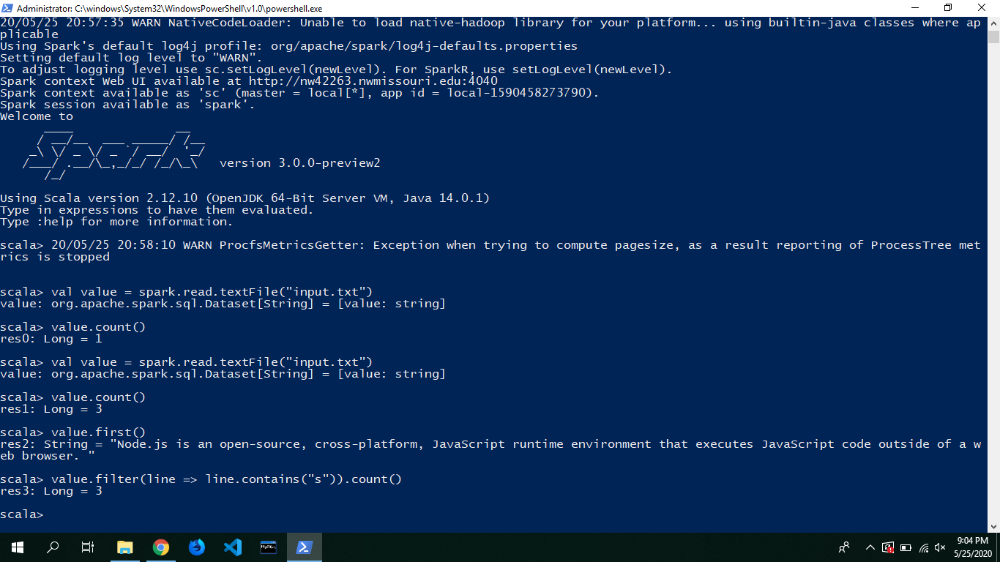

### To find the Most Repeated Word count in a file using scala

1. This reads the information from the input.txt
```val fileName = sc.textFile("input.txt")```
2. It splits the lines with spaces and displays the words which are more than 0
```val wordLength = fileName.flatMap(line => line.spilt(" ")).filter(word => word.trim().length() > 0)```
3. This displays the output of the wordLength
```wordLength.toDF().show()```
4. It appends the value 1 and it compares the key and value if the key is repeated then value is increased.
```val reduceWord = wordLength.map(word=>(word,1)).reduceByKey((a,b) => a + b)```
5. This displays the output of the reduceWord
```reduceWord.toDF().show()```
6. This displays most repeated word in the file and its count.
```val mostRepeatedWord = reduceWord.reduce((a,b) => if (a._2 > b._2) a else b)```

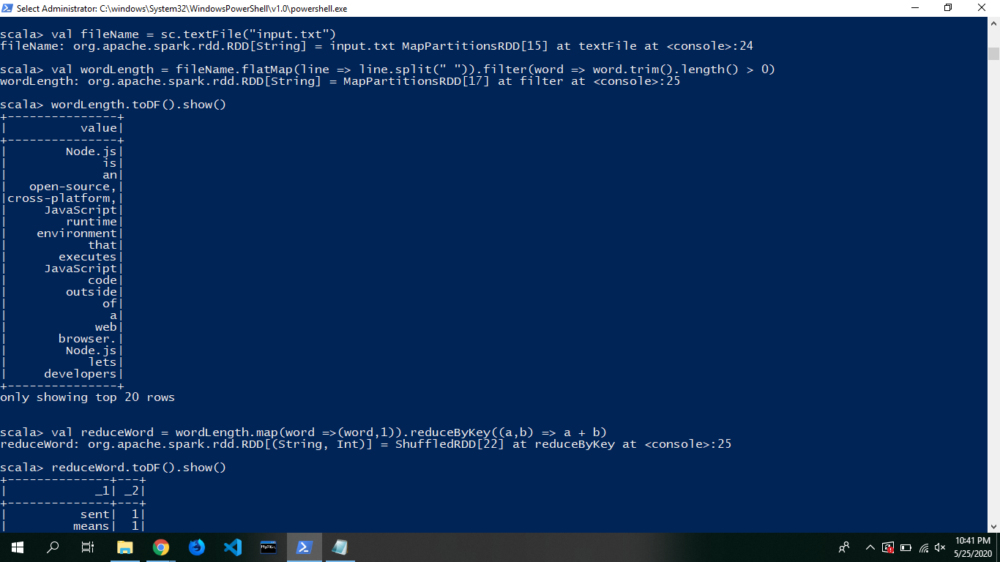


7. Spark shell jobs:


<<<<<<< HEAD
### Python
Spark SQL brings native support for SQL to Spark and streamlines the process of querying data stored both in RDDs (Spark’s distributed datasets) and in external sources. To execute SQL queries we are doing with python.We can execute sql commands on any file type like json, csv, text, and more. The data retrieval process is faster in the apache spark sql.
=======
## Python
Spark SQL brings native support for SQL to Spark and streamlines the process of querying data stored both in RDDs (Spark’s distributed datasets) and in external sources. To execute SQL queries we are doing with python. 
>>>>>>> a7c62452d4f6c1c23c8e173fba31b03ce522241e

#### Prerequisties
- Install spark and scala before downloading python
- Download anaconda python click on this link to follow the instructions
 [https://docs.anaconda.com/anaconda/install/windows/](https://docs.anaconda.com/anaconda/install/windows/)
- set the environment variables in system variables of python.

 
### SQL Queries peformed on JSON file

1. Reading json file and performing sql queries on it.
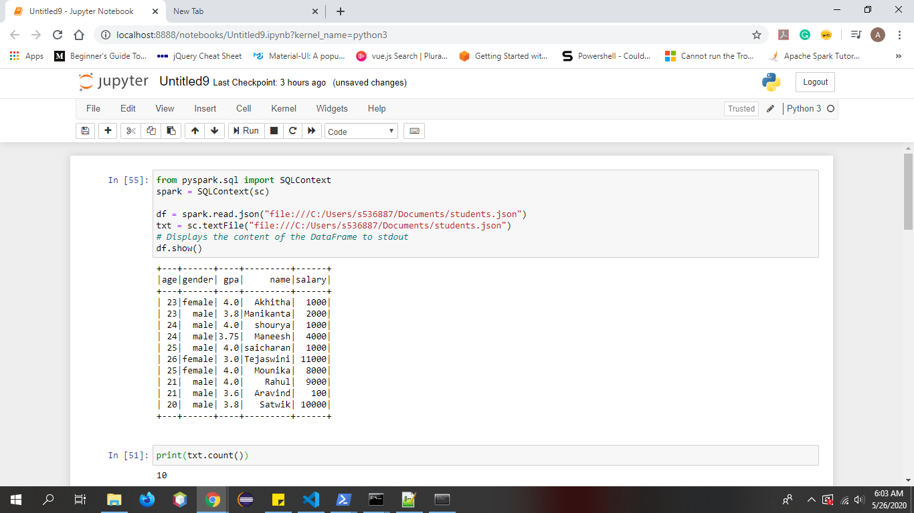
2. ```df.select("name").show() ```.This executes the select command in sql.
We can use different sql queries in the python like GroupBy, filter, aggregrations
commands:
- It displays gender withafter performing groupBy action 
```df.groupBy("gender").count().show() ```
- It displays the age of the students who are equal to 23
``` df.filter(df["age"]==23).show() ```
- It displays the maximum salary of the student
``` df.agg({"salary": "max"}).show()```

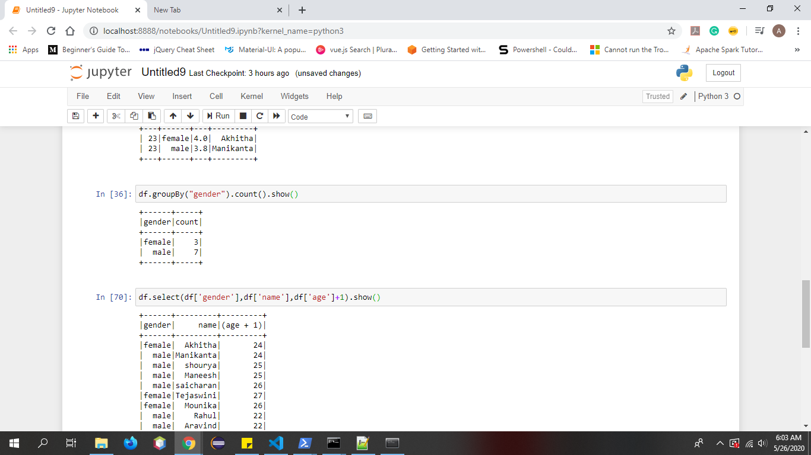
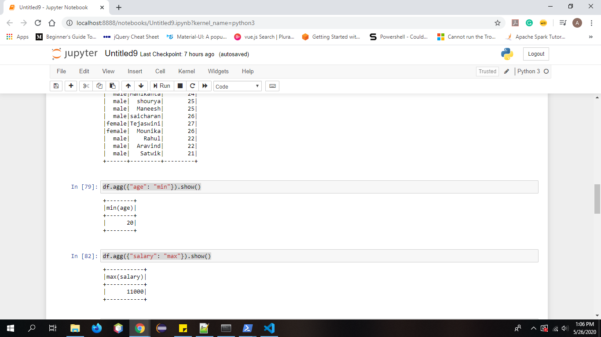


### SQL Queries performed on CSV file

1. Reading csv file and performing sql queries on it.

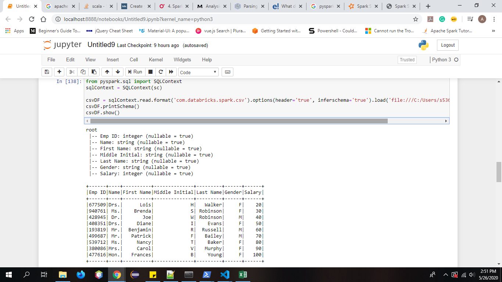

2. Performing some sql commands on csv file.

<<<<<<< HEAD
aggregrate commands :
- It displays the firstName of the employees
```csvDF.select("First Name").show()```
- It displays whose salary is greater than 21 of the employees
```csvDF.filter(csvDF['salary'] > 21).show()```
- It displays the minimum salary of the employees
```csvDF.agg({"salary": "min"}).show() ```

other commands:
```csvDF.groupBy("name").count().show() ```
=======
## Java
Even though Scala is the native and more popular Spark language, many enterprise-level projects are written in Java and so it is supported by the Spark stack with it’s own API.
### Steps to work with java:
1. Download eclipse from https://www.eclipse.org/downloads/
2. Open and create the Maven project
3. Add jar files which was present in Spark folder to the maven project jar folder.
4. Update POM.xml file with spark version
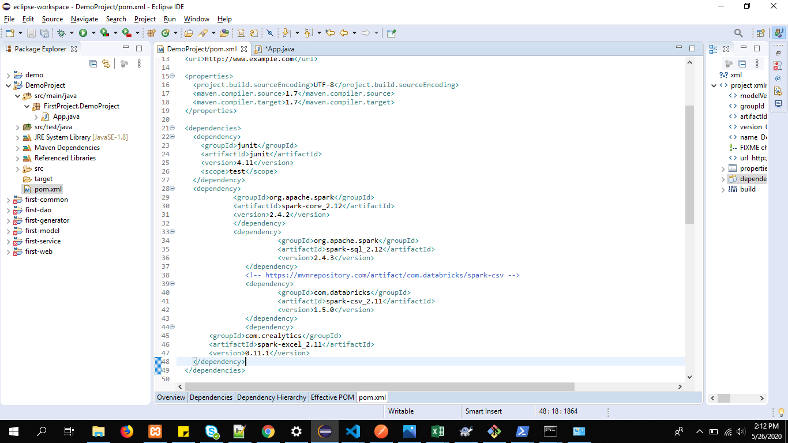
5.Write the code by importing requried modules.
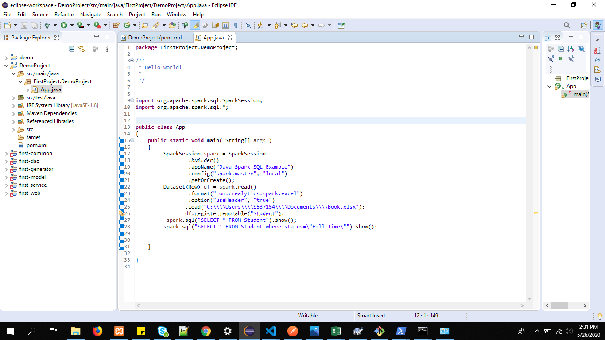
6.After running you will get results on output window.
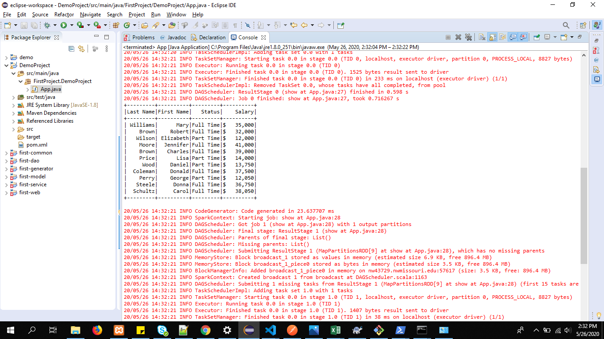
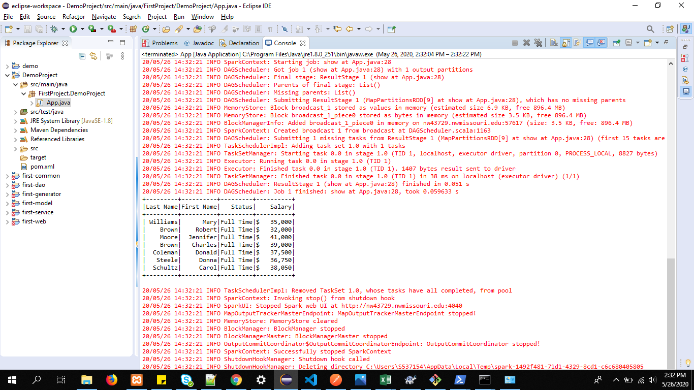
>>>>>>> a7c62452d4f6c1c23c8e173fba31b03ce522241e

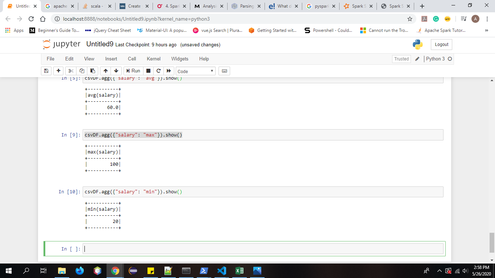

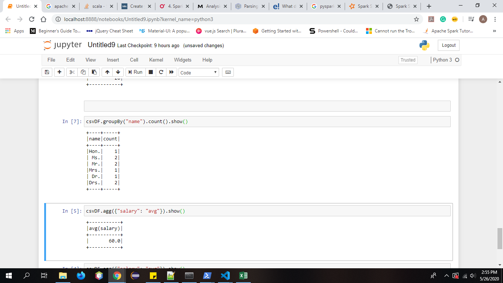


## References
1. https://spark.apache.org/docs/latest/quick-start.html
<<<<<<< HEAD

2. https://spark.apache.org/docs/2.2.0/sql-programming-guide.html 

3. https://www.youtube.com/watch?v=9mELEARcxJo
=======
2. https://blog.matthewrathbone.com/2015/12/28/java-spark-tutorial.html
3. https://www.edureka.co/blog/spark-java-tutorial/
>>>>>>> a7c62452d4f6c1c23c8e173fba31b03ce522241e
